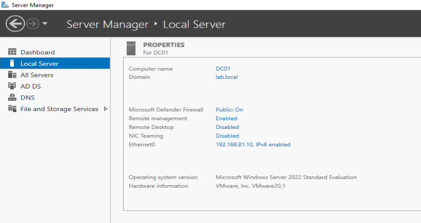
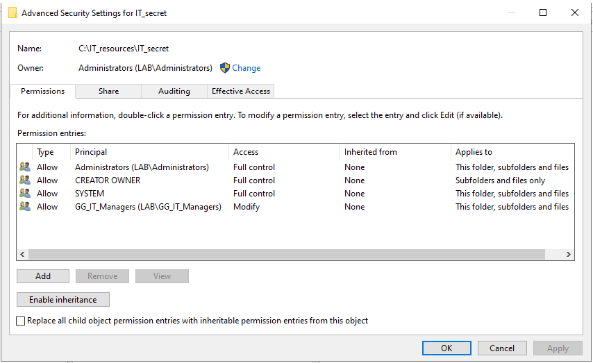
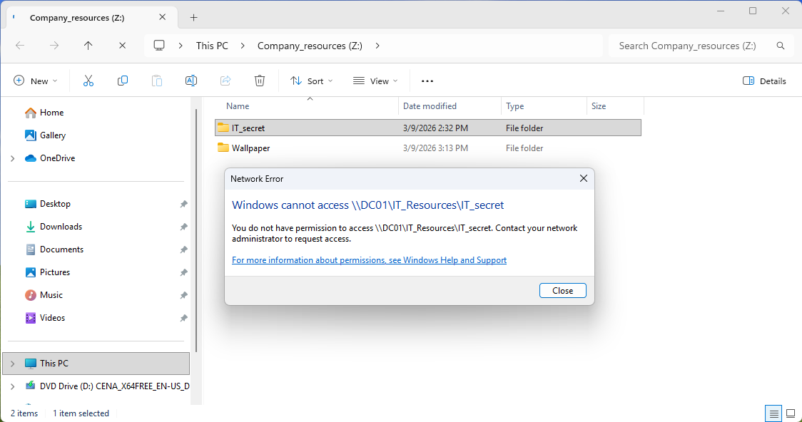

# Active Directory Hardening & Security Lab
Secure Windows Server 2022 &; Windows 11 enterprise environment deployment with IAM, RBAC, and System Hardening

## Objective
The primary goal of this project was to design, deploy, and secure an enterprise-grade Active Directory environment. This lab simulates a corporate network infrastructure, focusing on Identity and Access Management (IAM), Role-Based Access Control (RBAC), and System Hardening using Group Policy Objects (GPO).

## Technologies & Tools Used
* **Hypervisor:** VMware Workstation
* **Server OS:** Windows Server 2022 (Domain Controller - `DC01`)
* **Client OS:** Windows 11 Enterprise

## Architecture & Network Design
* **Domain Name:** `lab.local`
* **Network Segment:** NAT Network (192.168.81.0/24)
* **Domain Controller IP:** 192.168.81.10
* Configured DNS Forwarders for external connectivity while maintaining internal domain resolution.

> **Server configuration in Server Manager Panel**
>

## Key Scenarios & Security Implementations

### 1. Identity & Access Management (IAM)
Designed a logical Organizational Unit (OU) structure for efficient management. Created dedicated Security Groups (e.g., `GG_IT_Managers`, `Domain Users`) to move away from individual user permissions towards scalable, group-based management.

### 2. Role-Based Access Control (RBAC) & NTFS Security
Implemented strict file server security by breaking permission inheritance. Created a secure directory `IT_Secret` strictly accessible only to the `GG_IT_Managers` security group, effectively denying access to regular staff members.

> **NTFS Inheritance Broken & Access Denied for unauthorized user**
> 

### 3. GPO: Automation & Standardization
Automated the workstation provisioning process to ensure consistency across the domain:
* Automatically mapped network drives (`Z:` Company_resources) upon user logon.
* Enforced a unified corporate wallpaper across all client machines.

> **Automated Drive Mapping and Static Wallpaper**
> 

### 4. GPO: System Hardening & Security
Applied critical security policies to reduce the attack surface and protect against common lateral movement techniques:
* **Control Panel Restriction:** Completely blocked access to the Control Panel and Windows Settings for standard users to prevent unauthorized system modifications.
* **Brute Force Protection:** Configured an Account Lockout Policy (triggered after 5 failed login attempts) to mitigate dictionary and brute-force attacks.
* **Network Poisoning Mitigation:** Disabled LLMNR (Link-Local Multicast Name Resolution) via GPO to protect against Man-in-the-Middle and LLMNR poisoning attacks.
* **Audit Logging:** Enabled advanced audit policies for Logon/Logoff events (Success & Failure) to generate event logs.

## Lessons Learned
This lab provided hands-on experience with the realities of enterprise network administration. It bridged the gap between theoretical security concepts (PoLP, RBAC) and practical implementation using industry-standard Microsoft tools.
